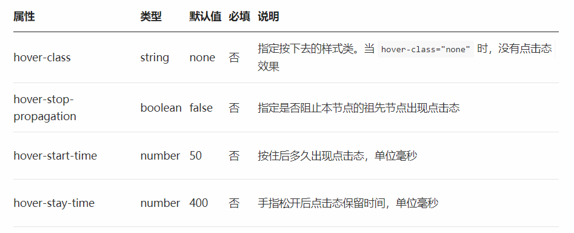
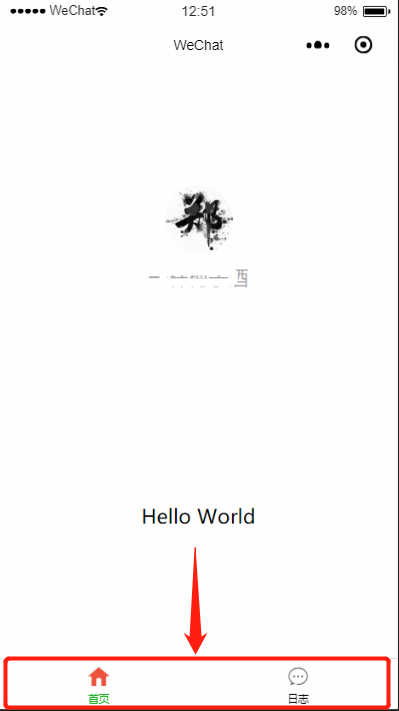
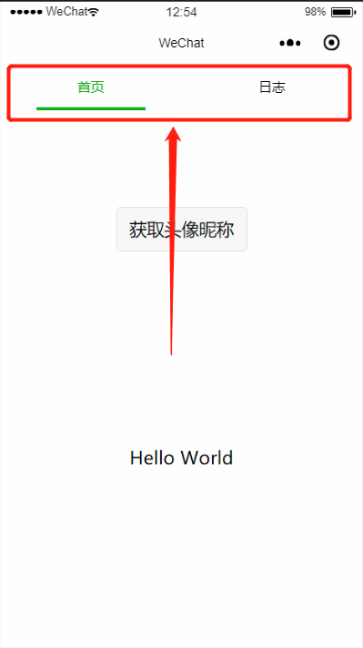
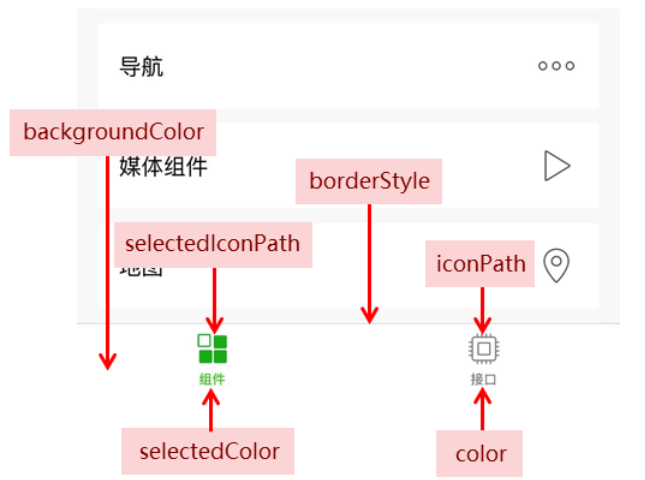
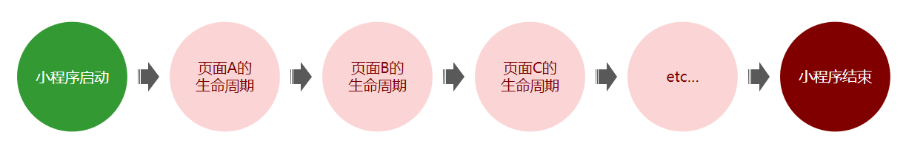

# day-01 微信小程序基础

## 一、什么是微信开发

### 01.什么是微信开发

```txt
微信对外提供了例如：聊天、支付、分享、收藏、人工智能等功能，同时微信还对外开放了很多的接口与能力，
程序员基于这些功能和接口进行的开发，叫做微信开发
```

### 02.为什么学习微信开发

```txt
企业开发需要
个人的发展以及技能的提升
```

`详情请见：` https://open.weixin.qq.com/

## 二、了解微信开放平台（了解即可）

```txt
微信开发平台是色为微信对外提供微信开放接口的一个平台,这些开发出来的微信接口，供第三方的网站或App使用
```

### 01.微信开放平台

1.微信公众平台
  是运营者通过公众号这个媒介，为微信用户提供咨询和服务的平台
2.微信公众平台开发
  指基于微信公众号进行的业务开发

### 02.微信公众号平台的账号分类

```txt
微信公众平台的账号统称为公众号
```

### 03.如何选择自己的公众号类型

1. 订阅号 -- 简单的发送消息，打到宣传效果，建议选择订阅号
2. 服务号 -- 想用公众号获得更多的功能、提供更多的服务，例如开通微信支付，建议选择服务号
3. 小程序 -- 想提供类似于手机`App`的服务体验，建议选择小程序
4. 企业微信（原名企业号） -- 想用来管理内部企业员工、团体、对内使用，进行以选择企业微信

## 四、开放平台和公众平台的区别（理解）

### 01.开放平台

1. 是微信对外开放`API`接口的平台
2. 开放的`API`接口，共第三方网站和`API`调用
3. 后端程序员是开放平台开放平台的主力军

### 02.公众平台

1. 是基于微信公众号，为微信用户提供服务的平台
2. 所用公众号，都属于微信内开发
3. 前端程序员是公众平台开发的主力军

## 五、认识小程序

### 01.什么是小程序

微信小程序是一种全新的连接用户和服务的媒介，它可以在微信内被便捷地获取和传播，同时具有出色地能力

1. 小程序地特点：体积小、方便获取于传播
2. 小程序的理念：用完即走

### 02.小程序出现的目的

1. 拦截用户流量入口，用户的大多数应用需求，都可以在威胁你小程序中得到满足

### 03.小程序和点越好、服务号的区别

- 发布时间不同
  - 2017-07 公众号发布
  - 2017-01 小程序发布
- 入口方式不同
  - 订阅号、服务号是作为微信联系人存在的
  - 小程序由自己的独立接口
- 体验效果不同
  - 订阅号、服务号体验差、无法提供提供类似于`APP`的体验
  - 小程序模拟了手机`APP`的体验更人心话

### 04.小程序蛇和的服务场景

- 适合做完即走的应用
  - 例如：外卖、打车、带价、共享单车
- 不适合做重度依赖的应用
  - 例如的大型手机游戏
    音乐播放器

### 05.小程序和传统手机APP的区别

- 开发原理不同
  -`APP`基于手机操作系统提供的`API`进行开发
- 运行方式不同
  - `APP`肢解安装在手机操作系统之上
  - 小程序： 必须基于手机微信安装才能运行

## 六、小程序中的组件

> 组件时视图层的基本组成单位，子弹袋一些功能于微信风格一致的样式

1. 初始组件
   一个组件通常包括开始抱歉和借宿标签，属性用力啊装饰这个组件，内容在两个变迁之间
   注意： 所有组件名称与属性名称都是小写

```html
<button type="primary">primary</button>
```

1. 推荐阅读
   - 组件API：https://www.developers.weixin.qq.com/miniprogram/dev/framework/app-service/api.html#API
   - 组件视图：https://www.developers.weixin.qq.com/miniprogram/dev/component

## 七、小程序中的API

### 01 - API的概念

1. `API`应用程序编程接口，是一些先定义的函数，目的是提供应用程序与开发人员基于某软件或硬件得以访问一组例程的能力
2. 小程序开发框架提供丰富的微信原生API，可以方便吊起微信提供的能力，如获取用户信息、本地存储、支付功能等。

### 02. `API`中的三种分类

1. 事件监听`API`
   - 以`on`开头的`API`用来监听某个事件是否触发
2. 同步`API`
   - 以`sync`结尾的`API`都是同步`API`
3. 异步`API`
   - 通常需要指定的回调函数接收调用的结果
   - 小程序中，大多数的`API`都是异步`API`

## 八、组件中的API的异同点

1. 相同点
   - 组件和`API`都是微信官方提供的
   - 组件和`API`的目的都是为了方便小程序的快速卡法
2. 不同点
   - 组件以`UI`结构布局为主，一般不需要处理业务逻辑
   - `API`以纯业务逻辑为主，一般没有对应的`UI`结构

## 九、注册小程序账号

> 搜索`微信开发开放平台`按照步骤注册即可，注意选择`小程序`选项

## 十、小程序基本信息设置

1. 登录小程序--> 设置-->基本设置

## 十一、小程序账号开发设置

1. 登录小程序--> 开发-->开发设置
2. 既可以查看到在实际开发中需要获取以及设置开发者ID以及服务器域名

## 十二、小程序站好的成员管理

### 01.成员管理的概念

1. 一个退队进行小程序开发，那么吐纳对团队成员的身份管理是很有必要的
2. 管理员可在小程序管理后台统一管理成员、设置项目成员的权限

### 02.权限管理说明

1. 运营者权限
   - 管理、推广、设置等模块权限，可使用体验版小程序
2. 开发者权限
   - 开发模块权限，可使用体验版小程序、开发者工具（IDE）
3. 数据分析者（基础分析）

### 03.添加方式

1. 登录小程序账号-->管理-->成员管理-->项目成员-->点击向下的箭头

## 十三、微信开发者工具

### 前往微信开发者官网下载稳定版

## 十四、创建小程序项目

1. 打开小程序开发者工具，用微信扫码登录开发者工具
2. 点击左侧菜单中的小程序选项
3. 点击+号创建小程序项目
4. 填写项目名称
5. 选择项目存放路径（必须选择空目录）
6. 填写`APPID`
7. 点击新建按钮

十五、小程序预览

> 作用：通过预览功能,可以在真机环境下快速查看小程序的实际效果

1. 点击工具栏-->预览即可弹出预览串口
2. 预览方式:扫描二维码预览、自动预览

# day02-小程序基础

---

## 一、 小程序项目的结构

```javascript
├── pages ······································ 【目录】存放所有的小程序页面
│   │── index ···································· 【目录】index 页面
│   │   ├── index.wxml ······························· 【文件】 index 页面的结构
│   │   ├── index.js ································· 【文件】 index 页面的逻辑
│   │   ├── index.json ······························· 【文件】 index 页面的配置
│   │   └── index.wxss ······························· 【文件】 index 页面的样式
│   └── logs ····································· 【目录】 logs 页面
│       ├── logs.wxml ································ 【文件】 logs 页面的结构
│       └── logs.js ·································· 【文件】 logs 页面的逻辑
└── utils ······································ 【目录】 存放小程序中用到的工具函数
├── app.js ····································· 【文件】 小程序逻辑
├── app.json ··································· 【文件】 小程序的公共配置
├── app.wxss ··································· 【文件】小程序公共样式表
├── project.config.json ························ 【文件】 开发工具配置文件
```

说明：

- `app.js` 是小程序的入口文件，运行小程序，第一个被运行的就是 `app.js`
- `app.json` 是小程序的全局配置文件，对小程序每个页面生效 
- `app.wxss` 是小程序的全局样式文件，对小程序每个页面生效

注意：

- 对于小程序运行而言，`app.js` 和 `app.json` 是必不可少的
- 对于小程序页面而言， `.js` 和 `.html` 文件是必不可少的

---

## 二、小程序页面的结构

### 001 - 小程序页面和 `Vue` 组件的对比

-  每个 `.vue` 文件，是由 `template` 模板结构、`script` 行为逻辑、`style` 样式三部分组成的
-  每个小程序页面，是由 `.wxml` 结构、`.js` 逻辑文件、`.json` 配置、`.wxss` 样式表这四部分组成的


### 002 - 小程序页面中每个文件的作用

-  `.wxml` : 用来描述当前这个页面的标签结构，同时提供了类似于 `Vue` 中指令的语法
-  `.js` : 用来定义当前页面中用到的数据、交互逻辑和响应用户的操作
-  `.json` : 用来定义当前页面的个性化配置，例如，为每个页面单独配置顶部颜色、是否允许下拉刷新等
-  `.wxss` : 用来定义样式来美化当前的页面

---

## 三、创建小程序页面

- 在 `pages` 目录上右键，选择 “新建目录”，输入目录名称
- 在新建的目录上，再次右键，选择 “新建 `page`” ，输入 `page` 名称

注意：

- 输入 `page` 名称以后，会自动创建四个文件

---

## 四、修改小程序项目的默认首页

- 打开 `app.json` 全局配置文件，找到 `pages` 节点。这个 pages 节点是一个数组，存储了项目中所有页面的访问路径。其中，`pages` 数组中第一个页面路径，就是小程序项目的默认首页。
- 所以只需要修改 pages 数组中路径的顺序，就可以可修改小程序的默认首页。

---

## 五、text文本组件的用法

> 小程序提供了丰富的基础组件给开发者，开发者可以像搭积木一样，组合各种组件拼接称自己的小程序
> 小程序中的组件，就像 `HTML` 中的 `div` 、`p`、`span` 等标签的作用一样，用于搭建页面的基础结构

### 001 - text 组件的属性

|    属性    |  类型   | 默认值 | 必填 |                      说明                      |
| :--------: | :-----: | :----: | :--: | :--------------------------------------------: |
| selectable | boolean | false  |  否  |                  文本是否可选                  |
|   space    | string  |   .    |  否  | 显示连续空格，可选参数：`ensp`、`emsp`、`nbsp` |
|   decode   | boolean | false  |  否  |                    是否解码                    |

**注： [text 组件详细文档](https://developers.weixin.qq.com/miniprogram/dev/component/text.html)**

- `text` 组件相当于行内标签、在同一行显示
- 除了文本节点以外的其他节点都无法长按选中

### 002 - 代码案例

```html
<view>
  <!-- 长按文本是否可选 -->
  <text selectable='true'>web</text>
</view>

<view>
  <!-- 显示连续空格的方式 -->
  <view>
    <text space='ensp'>H  a  c  k</text>
  </view>
  <view>
    <text space='emsp'>H  a  c  k</text>
  </view>
  <view>
    <text space='nbsp'>H  a  c  k</text>
  </view>
</view>

<view>
  <text>skyblue</text>
</view>

<view>
  <!-- 是否解码 -->
  <text decode='true'>&nbsp; &lt; &gt; &amp; &apos; &ensp; &emsp;</text>
</view>
```

---

## 六、view视图容器组件的用法

> View 视图容器， 类似于 HTML 中的 div

### 001-组件的属性



**注：[View 的详细文档](https://developers.weixin.qq.com/miniprogram/dev/component/view.html)**

### 002-代码案例

```html
<view hover-class='box1'>
  <view
    hover-stop-propagation='true'
    hover-class='box'
    hover-start-time='2000'
    hover-stay-time='3000'>
    box1
  </view>
</view>
```

---

## 七、button按钮组件的用法

### 001 - 组件的属性

|  属性名  |  类型   | 默认值  |           说明           |
| :------: | :-----: | :-----: | :----------------------: |
|   size   | String  | default |        按钮的大小        |
|   type   | String  | default |      按钮的样式类型      |
|  plain   | Boolean |  false  | 按钮是否镂空，背景色透明 |
| disabled | Boolean |  false  |         是否按钮         |
| loading  | Boolean |  false  | 名称是否带 loading t图标 |

**注：[Button 组件的详细文档](https://developers.weixin.qq.com/miniprogram/dev/component/button.html)**

- `button` 组件默认独占一行，设置 `size` 为 `mini` 时可以在一行显示多个

### 002 - 案例代码

```html
<button size='mini' type='primary'>前端</button>

<button size='mini' type='default' disabled='true'>前端</button>

<button size='mini' type='warn' loading='true'>前端</button>

```

---

## 八、input文本输入框组件的用法

### 001-input 组件属性

|   属性名    |  类型   | 默认值 |                  说明                  |
| :---------: | :-----: | :----: | :------------------------------------: |
|    value    | String  |   .    |            输入框的初始内容            |
|    type     | String  | 'text' |              input 的类型              |
|  password   | Boolean | false  |             是否是密码类型             |
| placeholder |  Sting  |   .    |           输入框为空时占位符           |
|  disabled   | Boolean | false  |                是否禁用                |
|  maxlength  | Number  |  140   | 最大输入长度，设置 -1 时不限制最大长度 |

**注：[input 组件的详细文档](https://developers.weixin.qq.com/miniprogram/dev/component/input.html)**

### 002-案例代码

```html
<input placeholder='111' type='idcard' placeholder-style="color: skyblue" />
```

---

## 九、image图片组件的用法

### 001-image 组件常用的属性

- `src` --  支持本地和网络上的图片
- `mode` -- 指定图片的裁剪、缩放的模式 

**注意：[image 图片组件详细文档](https://developers.weixin.qq.com/miniprogram/dev/component/image.html)** 

- image 组件默认的宽度是 `300px` 、`高度是225px`
- image组件中二维码/小程序码图片不支持长按识别

### 002-案例代码

```html
<image src='/assets/5.jpg' mode='aspectFit'></image>

<image src='https://wx.qlogo.cn/mmhead/Q3auHgzwzM7teJKyb7Oicw6x2rDiaD5BkDPFP2kccFO6a566TzzUyUgA/0' mode='widthFix'></image>
```

---

## 十、`wxss` 中常用的样式选择器

> `WXSS` 是一套样式语言，用来决定 `WXML` 的组件应该怎么显示

### 001  -  初始 `wxss` 

- `wxss` 具有 `css` 大部分特性
- `wxss` 对 `css` 进行了扩充以及修改，以适应微信小程序的开发

**注：[wxss 详细文档](https://developers.weixin.qq.com/miniprogram/dev/framework/view/wxss.html)**

### 002 - `wxss` 和 `css` 的区别  

- 尺寸单位
- 样式导入


---

## 十一、什么是 `wxss`

### 001 - `wxss` 目前支持的选择器

- 标签选择器
- id选择器
- class选择器
- 伪类选择器
- data-*属性选择器
- :nth-of-type() 等常用的 css3 选择器
- 其他…

**注： [wxss详细文档](https://developers.weixin.qq.com/miniprogram/dev/framework/view/wxss.html)**

### 002 - 案例代码

```css

view {
  font-size: 12px;
}

#box {
  color: skyblue;
}

.box {
  color: lightcoral;
}

.box1::before {
  content: '加油';
  color: lightgreen;
}

view:nth-of-type(4) {
  color: lightseagreen;
}

[data-color='pink'] {
  color: pink;
}
```

---

## 十二、什么是  `rpx` 尺寸单位

> `rpx`： 是微信小程序独有的，解决屏幕自适应的尺寸单位

- 可以根据屏幕宽度进行自适应，不论屏幕大小，规定屏幕宽为 `750rpx`
- 通过 `rpx` 设置元素和字体的大小，小程序在**不同尺寸**的屏幕上，**可以实现自动适配**

**注：[rpx 单位详细文档](https://developers.weixin.qq.com/miniprogram/dev/framework/view/wxss.html)**

---

## 十二、`rpx` 与 `px` 之间的换算

以 `iPhone6` 为例，`iPhone6`  的屏幕宽度为 `375px` ，共有 750 个物理像素，则 `750rpx` = `375px` = `750` 物理像素

也就是 **`1rpx` = `0.5px` = `1 物理像素`** 

|      设备      | `rpx` 换算 `px` (屏幕宽度/750) | `px` 换算 `rpx` (750/屏幕宽度) |
| :------------: | :----------------------------: | :----------------------------: |
|   `iPhone5`    |       `1rpx` = 0.42`px`        |       `1px` = `2.34rpx`        |
|   `iPhone6`    |        `1rpx` = `0.5px`        |         `1px` = `2rpx`         |
| `iPhone6 Plus` |       `1rpx` = `0.552px`       |       `1px` = `1.81rpx`        |

那么也就是说：如果在`iPhone6`上，

如果要绘制宽`100px`，高`20px`的盒子，换算成`rpx`单位，

宽高分别为 `200rpx` 和 `40rpx`

**注：[rpx 单位详细文档](https://developers.weixin.qq.com/miniprogram/dev/framework/view/wxss.html)**

---

## 十二、`rpx` 和 `iPhone6` 设计稿的关系

>开发微信小程序时设计师可以用 `iPhone6` 作为视觉稿的标准。

官方建议：

开发微信小程序时，设计师可以用 `iPhone6` 作为视觉稿的标准。

如果要根据 `iPhone6` 的设计稿，绘制小程序页面，可以直接把单位从 `px` 替换为 `rpx` 。

例如，假设 `iPhone6` 设计稿上，要绘制一个 宽高为 `200px` 的盒子，换算为 `rpx` 为 `200rpx`。

---

## 十三、 `@import` 样式导入

### 001 - 语法解释

- 使用 `@import` 语句可以导入外联样式表
- 语法格式：`@import "wxss 样式表文件的相对路径"`

### 002 - 案例代码

```css
@import "/assets/common/common.wxss";
/* @import "../../assets/common/common.wxss"; */

.box {
  width: 375rpx;
  height: 375rpx;
  background-color: skyblue;
}
```

---

## 十四、 全局样式和局部样式

### 001 - 全局样式

- 定义在 `app.wxss` 中的样式为全局样式，作用于每一个页面。

### 002 - 局部样式

- 在 `page` 的 `wxss` 文件中定义的样式为局部样式，只作用在对应的页面，并会覆盖 `app.wxss` 中相同的选择器。

**注意：当局部样式的权重大于或等于全局样式的权重时，才会覆盖全局的样式效果！**

**注：[wxss 详细文档](https://developers.weixin.qq.com/miniprogram/dev/framework/view/wxss.html)**

---

## 十五、`app.json` 配置文件

> 小程序根目录下的 `app.json` 文件用来对微信小程序进行全局配置，
>
> 它决定了页面文件的路径、窗口表现、设置网络超时时间、设置多 tab 等。

1. 在 `app.json` 配置文件中，最主要的配置节点是：
   - `pages` 数组：配置小程序的页面路径
   - `window` 对象：用于设置小程序的状态栏、导航条、标题、窗口背景色
   - `tabBar` 对象：配置小程序的tab栏效果

**注：[全局配置详细文档](https://developers.weixin.qq.com/miniprogram/dev/framework/config.html#全局配置)**

---

## 十六、`pages` 数组的用法

> `app.json` 中的 `pages` 数组，用来配置小程序的页面路径

### 001 -  基础配置

- `pages` 用于指定小程序由哪些页面组成，每一项都对应一个页面的 路径+文件名 信息。
- 文件名不需要写文件后缀，框架会自动去寻找对应位置的 `.json`、 `.js`、 `.wxml` 和 `.wxss` 四个文件进行处理。

### 002 -  创建页面的另一种方式

- 打开 `app.json` --> `pages` 数组节点 --> 新增页面路径并保存 --> 自动创建路径对应的页面

### 003 - 设置项目的首页

- 打开 `app.json` -> `pages` 数组节点
- 按需调整数组中路径的顺序，即可修改默认首页

**注意事项：**

- 数组的第一项代表小程序的小程序的初始页面也就是首页
- 小程序中新增/减少页面，都需要对 pages 数组进行修改，否则在运行小程序时就会报错

**注：[全局配置详细文档](https://developers.weixin.qq.com/miniprogram/dev/framework/config.html#全局配置)**

---

## 十七、小程序窗口的组成部分

**常见的属性配置： [常见的属性配置](https://developers.weixin.qq.com/miniprogram/dev/reference/configuration/page.html)**


## 十八、设置导航栏标题文字内容

- `app.json` --> `window` --> `navigationBarTitleText`
- 将属性值修改即可

## 十九、设置导航栏背景色

- `app.json` --> `window` --> `navigationBarBackgroundColor`
- 将属性值修改为指定的颜色就可以

## 二十、设置导航栏标题颜色

- `app.json` --> `window` --> `navigationBarTextStyle`
- 将属性值修改为指定的颜色就可以

## 二十一、全局开启下拉刷新功能

> 通过手指在屏幕上的下拉滑动操作，从而重新加载页面数据的行为

- `app.json` --> `window` --> 把 `enablePullDownRefresh` 的值设置为 true

## 二十二、设置下拉刷新窗口的背景色

> 当全局开启下拉刷新功能之后，默认的窗口背景为白色 

- `app.json` -> `window` ->  `backgroundColor` 

## 二十三、设置下拉loading的样式

> 当全局开启下拉刷新功能之后，默认窗口的loading样式为白色

- `app.json` --> `window` --> `backgroundTextStyle` 

## 二十四、设置上拉触底的距离

> 手指在屏幕上的上拉滑动操作，从而加载更多数据的行为

- `app.json` --> `window` --> `onReachBottomDistance` 

**注意： 默认距离为 `50px`，如果没有特殊需求，建议使用默认值即可**

## 二十五、`tabBar` 的概念

> `tabBar` 是移动端应用常见的页面效果，用于实现多页面的快速切换；小程序中通常将其分为底部 `tabBar` 和顶部 `tabBar`

**注意：`tabBar` 中，只能配置最少2个、最多5个 tab 页签，当渲染顶部 `tabBar` 的时候，不显示 `icon`，只显示文本**

**注： [tabbar 详细文档](https://developers.weixin.qq.com/miniprogram/dev/reference/configuration/app.html)**




## 二十六、`tabBar` 的组成部分

- `backgroundColor`：导航条背景色
- `selectedIconPath`：选中时的图片路径
- `borderStyle`：`tabBar`上边框的颜色
- `iconPath`：未选中时的图片路径
- `selectedColor`：`tab` 上的文字选中时的颜色
- `color`：`tab` 上的文字默认（未选中）颜色



## 二十七、`tabBar` 节点的配置项

### 001 - `tabBar` 节点的配置项

|      属性       |   类型   | 必填 | 默认值 |                            描述                            |
| :-------------: | :------: | :--: | :----: | :--------------------------------------------------------: |
|      color      | HexColor |  是  |   .    |          tab 上的文字默认颜色，仅支持十六进制颜色          |
|  selectedColor  | HexColor |  是  |   .    |        tab 上的文字选中时的颜色，仅支持十六进制颜色        |
| backgroundColor | HexColor |  是  |   .    |              tab 的背景色，仅支持十六进制颜色              |
|   borderStyle   |  string  |  否  | black  |       tabBar 上边框的颜色， 仅支持 `black` / `white`       |
|      list       |  Array   |  是  |   .    | tab 的列表，详见 `list` 属性说明，最少 2 个、最多 5 个 tab |
|    position     |  string  |  否  | bottom |           tabBar 的位置，仅支持 `bottom`/ `top`            |
|     custom      | boolean  |  否  | false  |                       自定义 tabBar                        |

### 002 - list 节点的配置项

|       属性       |  类型  | 必填 |                             说明                             |
| :--------------: | :----: | :--: | :----------------------------------------------------------: |
|     pagePath     | string |  是  |               页面路径，必须在 pages 中先定义                |
|       text       | string |  是  |                        tab 上按钮文字                        |
|     iconPath     | string |  否  |    图片路径，icon 大小限制为 40kb，建议尺寸为 81px * 81px    |
| selectedIconPath | string |  否  | 选中时的图片路径，icon 大小限制为 40kb，建议尺寸为 81px * 81px |

**注意：**

- **都不支持网络图片**
- **当 position 为 top 时，不显示 icon。**

## 二十八、页面配置

### 001 - 页面配置和局部配置的关系

- `app.json` 中的 `window` 节点，可以全局配置小程序中每个页面的窗口表现；
- 如果某些小程序页面，想要拥有特殊的窗口表现，此时，“页面级别的 `.json` 配置文件”就可以实现这种需求；

**注意：页面级别配置优先于全局配置生效**

### 002 - 页面配置属性

**注： [页面配置详细文档](https://developers.weixin.qq.com/miniprogram/dev/reference/configuration/page.html)**

## 二十九、生命周期的概念

> 生命周期（Life Cycle）是指一个对象从 创建 -> 运行 -> 销毁 的整个阶段，强调的是一个时间段。

### 001 - 小程序的生命周期

- 小程序的启动，表示生命周期的开始
- 小程序的关闭，表示生命周期的结束
- 中间小程序运行的过程，就是小程序的生命周期

### 002 - 小程序生命周期的两种类型

- 应用生命周期：特指小程序从启动 --> 运行 --> 销毁的过程；
- 页面生命周期：特指小程序中，每个页面的加载 --> 渲染 --> 销毁的过程；

**注意：页面的生命周期范围较小，应用程序的生命周期范围较大**



## 三十 、小程序的生命周期函数

> 小程序框架提供的内置函数，会伴随着生命周期，自动按次序执行

1. 生命周期函数的作用：

   允许程序员在特定的生命周期时间点上，执行某些特定的操作。例如，页面刚加载的时候，在生命周期函数中自动发起数据请求，获取当前页面的数据；

**注意：生命周期强调的是时间段，生命周期函数强调的是时间点。**

## 三十一、应用生命周期函数

### 001 - 小程序生命周期的分类

- 应用生命周期函数
- 页面生命周期函数

### 002 - 应用生命周期

- `app.js` 是小程序执行的入口文件，在 `app.js` 中必须调用 `App()` 函数，且只能调用一次。其中，`App()` 函数是用来注册并执行小程序的。
-  `App(Object)` 函数接收一个 `Object` 参数，可以通过这个 `Object` 参数，指定小程序的生命周期函数。

`app.js` 代码

```javascript
App({

  /**
   * 当小程序初始化完成时，会触发 onLaunch（全局只触发一次）
   */
  onLaunch: function () { },

  /**
   * 当小程序启动，或从后台进入前台显示，会触发 onShow
   */
  onShow: function (options) { },

  /**
   * 当小程序从前台进入后台，会触发 onHide
   */
  onHide: function () { },

  /**
   * 当小程序发生脚本错误，或者 api 调用失败时，会触发 onError 并带上错误信息
   */
  onError: function (msg) { }
})

```

## 三十二、页面生命周期函数

- 每个小程序页面，必须拥有自己的 `.js` 文件，且必须调用 `Page()` 函数，否则报错。其中 `Page()` 函数用来注册小程序页面。
- `Page(Object)` 函数接收一个 `Object` 参数，可以通过这个 `Object` 参数，指定页面的生命周期函数。

页面生命周期.js

```javascript
//index.js
//获取应用实例
const app = getApp()

Page({

  /**
   * 页面的初始数据
   */
  data: { },

  /**
   * 生命周期函数--监听页面加载
   */
  onLoad: function (options) { },

  /**
   * 生命周期函数--监听页面初次渲染完成
   */
  onReady: function () { },

  /**
   * 生命周期函数--监听页面显示
   */
  onShow: function () { },

  /**
   * 生命周期函数--监听页面隐藏
   */
  onHide: function () { },

  /**
   * 生命周期函数--监听页面卸载
   */
  onUnload: function () { },

  /**
   * 页面相关事件处理函数--监听用户下拉动作
   */
  onPullDownRefresh: function () { },

  /**
   * 页面上拉触底事件的处理函数
   */
  onReachBottom: function () { },

  /**
   * 用户点击右上角分享
   */
  onShareAppMessage: function () { }
})
```

# day03-小程序基础

---

## 一、数据绑定

### 001  - 如何定义页面的数据

- 小程序每个页面，是由 4 部分组成，其中 `.js` 文件内可以定义页面的数据、生命周期函数、其他业务逻辑
- 如果要在 `.js` 文件内定义页面的数据，只需把数据定义在 `data` 节点下即可

### 002 - `Mustache` 语法格式

> 把 `data` 中的数据绑定到页面中渲染，使用 `Mustache` 语法(双大括号) 将变量包裹起来即可

```html
<view>{{ info }}</view>
```

- `Mustache` 语法的主要场景
  - 绑定内容
  - 绑定属性
  - 运算(三元表达式、算术运算、逻辑判断、字符串运算、数据路径运算)

### 003 - 案例代码

 ```html
<!-- 页面结构 -->

<!-- 绑定内容和属性 -->
<view id="item-{{id}}">{{ info }}</view>

<!-- 算数运算 -->
<view>{{ 1 + 1 }}</view>

<!-- 三元表达式 -->
<view>{{ id == 10 ? "正确" : "错误" }}</view>
 ```

```javascript
// 页面数据

Page({
  data: {
    info: 'i miss you',
    id: 10,
    arr: [1, 2, 3]
  }
})
```

---

## 二、小程序中的事件

### 001 - 什么是事件

- 事件是视图层到逻辑层的通讯方式
- 事件可以将用户的行为反馈到逻辑层中进行处理
- 事件可以绑定到组件上，当组件触发事件，就会执行逻辑层中对应的事件处理函数
- 事件对象可以携带额外信息，如： `id`、`dataset`、 `touches`

### 002 - `bindtap` 绑定触摸事件

- 在小程序中，不存在网页中的 `onclick` 鼠标点击事件，而是通过 `tap` 事件来响应触摸行为
- 在小程序中，可以通过 `input` 事件来响应文本框内的输入事件
  - 使用 `bindinput` 为文本框绑定输入事件

### 003 -  `data` 和 文本框之间的数据同步

- 在文本框的 `input` 事件处理函数中，通过事件参数 `event` ，能够访问到文本框的最新值
  - 语法结构 `event.detail.value` 
- 通过 `this.setData(dataObject)` 方法，可以把页面中的 `data` 数据重新赋值

### 004 - 案例代码

```html
<!-- 页面结构 -->

<button bindtap='handle' type='warn'>我是按钮</button>

<input bindinput='inputHandle' value='输入框'></input>

<input bindinput='datasync' value='{{ msg }}'></input>
```

```javascript
// 页面逻辑

Page({
  data: {
    msg: ''
  },
   
  handle: function (event) {
    console.log('按钮绑定的事件')
    console.log(event)
  },

  inputHandle: function (e) {
    console.log(e)
  },

  // 数据同步演示
  datasync: function (e) {
    console.log(e.detail.value)
    
    this.setData({
      msg: e.detail.value
    })
  }
  
  // coding...
})
```

---

## 三、小程序中的事件传参

### 001 -  不能再绑定事件的同时传递参数

- 小程序的事件传参比较特殊，不能在为组件绑定事件的同时，为事件处理函数传递参数
- 小程序会把 `bindtap` 后指定的值，统一当做事件名称来处理

```javascript
// 错误做法
<button bindtap='eventHandle(123)' type='primary' data-info='info'>传递参数</button>
```

### 002 - 通过 `data-*` 自定义属性传参

- 如果要在组件触发事件处理函数的时候，传递参数，可以为组件提供 `data-*` 自定义属性传参

### 003 -  获取 `data-*` 自定义属性中传递的参数

- 通过事件参数 `event-target-dataset.参数名`，能够获取 `data-*` 自定义属性传递到事件处理函数中的参数

### 004 - 案例代码

```html
<!-- 页面结构 -->

<button bindtap='eventHandle' type='primary' data-info='info'>传递参数</button>
```

```javascript
// 页面逻辑

Page({
  data: {},
    
  eventHandle: function (e) {
    console.log(e.target.dataset.info)
  }
   
  // coding...
})
```

---

## 四、`WXS` 脚本简介

### 001 - 什么是 `wxs`

- `wxs` 是小程序的一套脚本语言，结合 `wxml` ，可以构建出页面的结构

### 002 - `wxs` 的注意事项

- 没有兼容性
  - `wxs` 不依赖于运行时的基础库版本，可以在所有版本的小程序中运行
- 与 `javascript` 不同
  - `wxs` 与 `javascript` 是不同的语言，有自己的语法，并不和 `javascript` 一致
- 隔离性
  - `wxs` 的运行环境和其他 `javascript` 代码是隔离的
  - `wxs` 中不能调用其他 `javascript` 文件中定义的函数，也不能调用小程序提供的`API`
- 不能作为事件回调
  - `wxs` 函数不能作为组件的事件回调
- `iOS`设备上比 `javascript` 运行快
  - 由于运行环境的差异，在 `iOS` 设备上小程序内的 `wxs` 会比 `javascript` 代码快 2 ~ 20 倍。
  - 在 `android` 设备上二者运行效率无差异 

### 003 -  `wxs` 遵循 `CommonJS` 模块化规范

> `CommonJS` 是 `javascript` 的模块化规范之一，小程序的脚本语言 `wxs` 遵循了 `CommonJS` 规范，因此，使用 `wxs` 时的体验和使用 `node.js` 的体验比较相似。

- `module` 对象
  - 每个 `wxs` 都是独立的模块，每个模块均有一个内置的 module 对象，每个模块都有自己独立的作用域。
- `module.exports`
  - 由于 `wxs` 拥有独立作用域，所以在一个模块里面定义的变量与函数，默认为私有的，对其他模块不可见，
  - 通过 `module.exports` 属性，可以对外共享本模块的私有变量与函数。
- require函数
  - 在 `wxs` 模块中引用其他 `wxs` 文件模块，可以使用 `require` 函数。

---

## 五、`wxs` 基础语法

### 001 -  使用 `module.exports` 向外共享成员

- 通过 module.exports 属性，可以对外共享本模块的私有变量与函数

```javascript
var foo = “‘hello world’ from wxs”; // 定义私有变量 foo
var bar = function (d) {            // 定义私有函数 bar
  return d
}

// 通过 modules.exports 向外共享私有成员
module.exports = {
  FOO: foo, // 向外共享私有变量 foo
  bar: ba, // 向外共享私有函数 bar
};

// module.exports 中挂载 msg 变量
module.exports.msg = “some msg”

```

### 002 - 使用  `require` 引入其它  `wxs` 模块 以及注意事项

- 在 `wxs` 模块中引用其他 `wxs` 文件模块，可以使用 require 函数。

```javascript
// 使用 require 导入 tools.wxs 脚本
var tools = require("./tools.wxs")

// 得到的 tools 对象，可以直接访问到 tools.wxs 中向外暴露的变量和方法
console.log(tools)

```

**注意事项 ：**

- 只能引用 `wxs` 文件模块，且**必须使用相对路径**
- `wxs` 模块均为单例
  - `wxs` 模块在第一次被引用时，会自动初始化为单例对象。
  - 多个页面，多个地方，多次引用，使用的都是同一个 `wxs` 模块对象。
- 如果一个 `wxs` 模块在定义之后，一直没有被引用，则该模块不会被解析与运行。

### 003 - 支持的数据类型

- `WXS` 语言目前共有以下8种数据类型：
  - `number` 数值类型
  - `string` 字符串类型
  - `boolean` 布尔类型
  - `object` 对象类型
  - `function` 函数类型
  - `array` 数组类型
  - `date` 日期类型
  - `regexp` 正则

**注意事项**

注意：由于`wxs` 与 `javascript` 是不同的语言，有自己的语法，并不和 `javascript` 一致，

所以在使用以上8种数据类型的时候，一定要先翻阅官方文档，再进行使用！

**参考文档： [数据类型](https://developers.weixin.qq.com/miniprogram/dev/framework/view/wxs/06datatype.html)**

---

## 六、内嵌 `wxs` 脚本

### 001 - 使用规则

- `wxs` 代码可以编写在 `wxml` 文件中的 `<wxs></wxs>` 标签内，就像 `javascript` 代码可以编写在 `html` 文件中的 `<script></script>` 标签内一样。
- `wxml` 文件中的每个 `<wxs></wxs>` 标签，**必须提供一个 `module` 属性**，用来指定当前 `<wxs></wxs>` 标签的模块名。在单个 `wxml` 文件内，建议其值唯一。
- module 属性值的命名必须符合下面两个规则：
  - 首字符必须是：字母（a-z A-Z），下划线（_）
  - 剩余字符可以是：字母（a-z A-Z），下划线（_）， 数字（0-9） 

### 002 -  案例代码

```html
<view>{{ info.msg }}</view>

<wxs module='info'>
  var msg = '我在等风来'

  module.exports = {
    msg: msg
  }
</wxs>
```

---

## 七、外联 `wxs` 脚本文件

### 001 - 使用规则

- `wxs` 代码可以编写在以 `.wxs` 为后缀名的文件内，就像 j`avascript` 代码可以编写在以 `.js` 为后缀名文件中一样。
- 在 `wxml` 中如果要引入外联的 `wxs` 脚本，必须为 `<wxs></wxs>` 标签添加 `module` 和 `src` 属性。
  - `module` 用来为 `<wxs></wxs>` 标签指定模块名，作为当前页面访问这个模块的标识名称；
  - `src` 用来指定当前 `<wxs></wxs>` 标签要引入的脚本路径，必须是相对路径；

### 002 - 案例代码

```javascript
// .wxs 文件

var msg = '风铃响,故人归'
var handle = function (params) {
    return params
}

module.exports = {
  msg: msg,
  handle: handle
}
```

```html
<wxs src='./ling.wxs' module='feng'></wxs>
<view>{{ feng.msg }}</view>
<view>{{ feng.handle('我在等风') }}</view>
```

**注意：在 `wxs`中不要使用高级的`JS`语法**

---

## 八、条件渲染

### 001 -  `wx:if`

- 在小程序中，使用 `wx:if="{{condition}}" `来判断是否需要渲染该代码块
- 也可以用 `wx:elif` 和 `wx:else` 来添加一个 else 块

```html
<view wx:if='{{id < 10}}'>JavaScript</view>
<view wx:elif='{{id == 10}}'>HTML</view>
<view wx:else='{{id > 10}}'>CSS</view>
```

### 002 - `block wx:if`

- 因为 `wx:if` 是一个控制属性，需要将它添加到一个标签上。
- 如果要一次性判断多个组件标签，可以使用一个 `<block></block>` 标签将多个组件包装起来，并在上边使用 `wx:if` 控制属性。
- **`<block/>` 并不是一个组件，它仅仅是一个包装元素，不会在页面中做任何渲染，只接受控制属性。**

```html
<block wx:if='{{ id == 10 }}'>
  <view>JavaScript</view>
  <view>HTML</view>
  <view>CSS</view>
</block>
```

### 003 -  hidden

- 使用 `hidden="{{condition}}"` 也能控制元素的显示与隐藏

```html
<view hidden='{{ id > 10 }}'>前端三板斧</view>
```

### 004 - hidden 和 `wx:if` 的区别

- 被 `wx:if` 控制的区域，框架有一个局部渲染的过程，会根据控制条件的改变，动态创建或销毁对应的 `UI`结构。
- `wx:if` 是惰性的，如果在初始渲染条件为 false，框架什么也不做，在条件第一次变成真的时候才开始局部渲染。 
- 相比之下，hidden 就简单的多，组件始终会被渲染，只是简单的控制显示与隐藏。
- **总结：**`wx:if` 有更高的切换消耗而 hidden 有更高的初始渲染消耗。因此，如果需要频繁切换的情景下，用 hidden 更好，如果在运行时条件不大可能改变则 `wx:if` 较好。

## 九、列表渲染

### 001 -  wx:for

- 在组件上使用 `wx:for` 控制属性绑定一个数组，即可使用数组中各项的数据重复渲染该组件。
- 默认数组的当前项的下标变量名默认为 `index`，数组当前项的变量名默认为 `item`。

```html
<view wx:for='{{ arr }}' wx:key='index'>
  我是{{ item }} -- 索引是 {{ index }}
</view>
```

### 002 - `block wx:for`

- `wx:for` 可以用在 `<block></block>` 标签上，以渲染一个包含多节点的结构块。

```html
<block wx:for='{{ arr }}' wx:key='index'>
  <view>值：{{item}} -- 索引{{index}}</view>
</block>
```

### 003 - 指定索引和当前项的变量名

- 使用 `wx:for-item` 可以指定数组当前元素的变量名
- 使用 `wx:for-index` 可以指定数组当前下标的变量名，

```html
<view wx:for='{{ arr }}' wx:for-item='foritem' wx:for-index='forindex' wx:key='index'>
  我是{{ foritem }} -- 索引是 {{ forindex }}
</view>
```

### 004 -  列表渲染中的 `wx:key`

1. `wx:key` 的作用说明

   - 如果列表中项目的位置会动态改变或者有新的项目添加到列表中，并且希望列表中的项目保持自己的特征和状态（如 `<input/>` 中的输入内容，`<checkbox/>` 的选中状态），需要使用 `wx:key` 来指定列表中项目的唯一的标识符。

   - 当数据改变触发渲染层重新渲染的时候，会校正带有 key 的组件，**框架会确保他们被重新排序，而不是重新创建**，以确保使组件保持自身的状态，并且提高列表渲染时的效率。

2. `wx:key` 的注意事项
   - `key` 值必须具有唯一性，且不能动态改变
   - `key` 的值必须是数字或字符串
   - 保留关键字 `*this` 代表在 `for` 循环中的 `item` 本身，它也可以充当 `key` 值，但是有以下限制：需要 `item` 本身是一个唯一的字符串或者数字。
   - 如不提供 `wx:key`，会报一个 `warning`， 如果明确知道该列表是静态，或者不必关注其顺序，可以选择忽略。

## 十、下拉刷新

### 001 - 下拉刷新的概念以及场景

- 概念：下拉刷新是移动端更新列表数据的交互行为，用户通过手指在屏幕上自上而下的滑动，可以触发页面的下拉刷新，更新列表数据。
- 应用场景：在移动端，数据列表是常见的页面效果，更新列表数据是最基本的页面需求，相比于按钮刷新、定时刷新来说，下拉刷新的用户体验方便友好，已经成为移动端刷新列表数据的最佳解决方案。

### 002 -  如何启动下拉刷新

- 在 `app.json` 的 `window` 选项中或页面配置中开启 `enablePullDownRefresh`。
- 可以通过 `wx.startPullDownRefresh()` 触发下拉刷新，调用后触发下拉刷新动画，效果与用户手动下拉刷新一致。

**注意：一般情况下，推荐在页面配置中为需要的页面单独开启下拉刷新行为**

### 003 - 设置下拉刷新窗口的样式

- 在 `app.json` 的 `window` 选项中或页面配置中修改 `backgroundColor` 和 `backgroundTextStyle` 选项。
- `backgroundColor` 用来配置下拉刷新窗口的背景颜色，仅支持16进制颜色值
- `backgroundTextStyle` 用来配置下拉刷新 `loading` 的样式，仅支持 `dark` 和 `light`

### 004 - 监听下拉刷新事件

> 需要先开启下拉刷新

- 为页面添加 `onPullDownRefresh()` 函数，可以监听用户在当前页面的下拉刷新事件。

```javascript
/**
 * 页面相关事件处理函数--监听用户下拉动作
 */
onPullDownRefresh: function () {
  console.log('触发下拉刷新啦')
}
```

### 005 - 停止下拉刷新

- 处理完下拉刷新后，下拉刷新的 loading 效果会一直显示，不会主动消失，
- 因此需要手动隐藏下拉刷新的 loading 效果，调用 `wx.stopPullDownRefresh()` 可以停止当前页面的下拉刷新。

```javascript
/**
 * 页面相关事件处理函数--监听用户下拉动作
 */
onPullDownRefresh: function () {
  console.log('触发下拉刷新啦')
    
  wx.stopPullDownRefresh()
}
```

---

## 十一、上拉刷新

### 001 - 上拉刷新的概念以及场景

- 概念：在移动端，随着手指不断向上滑动，当内容将要到达屏幕底部的时候，页面会随之不断的加载后续内容，直到没有新内容为止，我们称之为上拉加载更多。上拉加载更多的本质就是数据的分页加载。
- 应用场景：在移动端，列表数据的分页加载，首选的实现方式就是上拉加载更多。

### 002 -  设置上拉刷新的距离

- 在 `app.json` 的 `window`选项中或页面配置中设置触底距离 `onReachBottomDistance`。单位为`px`，默认触底距离为 `50px`。
- 为页面添加 `onReachBottom()` 函数，可以监听用户在当前页面的上拉触底事件，从而实现上拉加载更多列表数据的效果。

```javascript
/**
 * 页面上拉触底事件的处理函数
 */
onReachBottom: function () {
  console.log('触发上拉刷新啦')
},
```

## 十二、其他事件

### 001 -  页面滑动事件`onPageScroll`

- 监听用户滑动页面事件
  - 得到 `scrollTop`，页面在垂直方向已滚动的距离（单位`px`）

```javascript
onPageScroll: function (e) {
  console.log(e)
}
```

### 002 - 分享事件 `onShareAppMessage`

- 监听用户点击页面内转发按钮（`<button> 组件 open-type="share"`）
- 右上角菜单“转发”按钮的行为，并自定义转发内容。

|     参数     |   类型   |                             说明                             |
| :----------: | :------: | :----------------------------------------------------------: |
|    `from`    | `String` |  转发事件来源。button：页面内转发按钮；menu：右上角转发菜单  |
|   `target`   | `Object` | 如果 from 值是 button，则 target 是触发这次转发事件的 button，否则为 undefined |
| `webViewUrl` | `String` |     页面中包含<web-view>组件时，返回当前<web-view>的url      |

- 自定义转发内容， return 一个 Object 就可以

|    字段    |                             说明                             |                  默认值                   |
| :--------: | :----------------------------------------------------------: | :---------------------------------------: |
|  `title`   |                           转发标题                           |              当前小程序名称               |
|   `path`   |                           转发路径                           | 当前页面 path ，必须是以 / 开头的完整路径 |
| `imageUrl` | 自定义图片路径，可以是本地文件路径、代码包文件路径或者网络图片路径。支持`PNG`及`JPG`。显示图片长宽比是 5:4。 |               使用默认截图                |

```javascript
Page({
  onShareAppMessage: function (res) {
    if (res.from === 'button') {
      // 来自页面内转发按钮
      console.log(res.target)
    }
    return {
      title: '自定义转发标题',
      path: '/page/user?id=123'
    }
  }
})

```

### 003 - 点击 tab 时触发事件 `onTabItemTap`

|    参数    |   类型   |               说明               |
| :--------: | :------: | :------------------------------: |
|  `index`   | `String` | 被点击 `tabItem` 的序号，从0开始 |
| `pagePath` | `String` |    被点击`tabItem` 的页面路径    |
|   `text`   | `String` |   被点击 `tabItem` 的按钮文字    |

```javascript
onTabItemTap(item) {
  console.log(item.index)
  console.log(item.pagePath)
  console.log(item.text)
}
```


# day04
## 导航
### 标签导航——导航到非tapBar页面
> 使用navigator标签 添加相对要跳转的相对路径
```html
<navigator url="/pages/user/user">跳转到用户页面</navigator>
```
>

### 标签导航——导航到tapBar页面
> 使用navigator标签 添加相对要跳转的相对路径和`open-type`属性为`switchTab`
```html
  <navigator url="/pages/logs/logs" open-type="switchTab">跳转到导航中的日志页面</navigator>
```

### 编程式导航———导航到非tapBar页面
> 1. 在`wxml`页面中定义标签添加事件
```html
  <button type="primary" bindtap="handleViewUser">跳转到用户中心</button>
```
> 2. 在js文件中编写事件代码体
```js
 handleViewUser() {
  wx.navigateTo({
    url: '/pages/user/user'
  })
},
```

### 编程式导航——导航到tapBar页面
> 1. 在`wxml`给组件注册事件
```html
  <button type="primary" bindtap="handleViewLogs">跳转到用户中心</button>
```
> 2. 在js文件中编写事件代码体
```js
handleViewLogs() {
  wx.switchTab({
    url: '/pages/logs/logs',
  })
},
```

## 导航传参
### 标签导航传参
> 1. 在标签路劲直接添加http协议式的参数 即`？`+`键值对` 以`&`分隔
```html
  <navigator url="/pages/user/user?name='张三'&age=18">跳转到用户页面</navigator>
```
> 2. 可以在对应的页面关联的`js`中的onLoad生命周期函数中的参数options获取到传递的键值对
```js
onLoad: function (options) {
  console.log(options) //{name: "张三", age: "18"}
},
```

### 编程式导航传参
> 1. 在`index.wxml`给组件注册事件
```html
  <button type="primary" bindtap="handleViewLogs">跳转到用户中心</button>
```

> 2. 在`index.js`文件中编写事件代码体
```js
handleViewUser() {
  wx.navigateTo({
    url: '/pages/user/user?name=张三&age=18',
  })
},
```
> 3. 可以在对应的页面关联的`js`中的onLoad生命周期函数中的参数options获取到传递的键值对
```js
onLoad: function (options) {
  console.log(options) //{name: "张三", age: "18"}
},
```
## 网络数据请求
### 跳过域名校验
```txt
在微信开发者工具中，可以临时开启 「开发环境不校验请求域名、TLS 版本及 HTTPS 证书」 选项，跳过服务器域名的校验。此时，在微信开发者工具中及手机开启调试模式时，不会进行服务器域名的校验。
```
### 发送get请求
> 1. 在`index.wxml`给组件注册事件,
```html
  <button type="primary" bindtap="handleReadMusic">听听音乐</button>
```
> 2. 发起请求获取音乐接口数据，定义数据接收获取到的资源并双向绑定到data中
```js
data: {
  poster: "",
  author: "",
  name: "",
  src: "",
},
handleReadMusic() {
  var that = this
  // 发起请求
  wx.request({
    url: 'https://api.uomg.com/api/rand.music?sort=热歌榜&format=json',
    methods: "GET",
    success: function(res) {
      console.log(res);
      // 定义数据
      that.setData({
        poster: res.data.data.picurl,
        author: res.data.data.artistsname,
        name: res.data.data.name,
        src: res.data.data.url
      })
    }
  })
},
```
> 3. audio标签渲染页面
```html
  <audio src="{{src}}" name="{{name}}" author="{{author}}" id="MyAudio" poster="{{poster}}" controls loop></audio>
```
- 如果不设置methods默认是get请求

## 组件
### 创建组件
-  在项目的根目录中，鼠标右键，创建 components 文件夹 --> test 
- 在新建的 components -> test 文件夹上，鼠标右键，点击“新建 Component”
- 为新建的组件命名之后，会自动生成组件对应的 4 个文件，后缀名分别为 `.js`，`.json`， `.wxml` 和 `.wxss`
```html
<view>这是com组件</view>
```
### 引用组件

- 在需要引用组件的页面中，找到页面的 `.json` 配置文件，新增 `usingComponents` 节点
- 在 `usingComponents` 中，通过键值对的形式，注册组件；键为注册的组件名称，值为组件的**相对路径**
- 在页面的 `.wxml` 文件中，把注册的组件名称，以**标签形式在页面上使用**，即可把组件展示到页面上
```json
{
  "usingComponents": {
    "com": "../../components/com/com"
  }
}
```
**注册组件名称时，建议把组件名称使用中横线进行连接，例如 vant-button 或 custom-button**

### 组件的私有数据定义
- 小程序组件中的 `data`与小程序页面中的 `data` 用法一致，区别是：

  - 页面的 `data` 定义在 `Page()` 函数中
  - 组件的 `data` 定义在 `Component()` 函数中

- 在组件的 `.js` 文件中：

  - 如果要访问 `data` 中的数据，直接使用 `this.data.数据名称` 即可
  - 如果要为 `data` 中的数据重新赋值，调用 `this.setData({ 数据名称: 新值 })` 即可

- 在组件的 .wxml 文件中

  - 如果要渲染 data 中的数据，直接使用 {{ 数据名称 }} 即可
```js
data: {
  name: "康康"
}
```
```html
<view>这是com组件——{{name}}</view>
```
### 组件私有事件
- 和页面不同，组件的事件处理函数，必须定义在 methods 节点中
```js
methods: {
  handle: function () {
    console.log('组件的方法要定义在 methods 中')
    this.setData({
      num: this.data.num + 1
    })
    console.log(this.data.num)
  }
}
```

### 组件传值(父传子)
> 1. 在父组件中引入组件之后，在组件标签上定义`自定义属性`建议使用XXX-XXX定义
`父组件wxml`
```html
  <com prop-age="{{kangage}}"></com>
```
`父组件js`
```js
kangage: {
  family: "kang",
  age: 18
}
```
> 2. 在子组件中接收数据，并渲染到自己的wxml上
```js
properties: {
  propAge: {
    type: Object,
    value: ""
  }
},
```
**注意：type 的可选值为 Number，String、Boolean、Object、Array、null(表示不限制类型)**
```html
<view>这是com组件——{{name}}{{propAge.age}}</view>
```