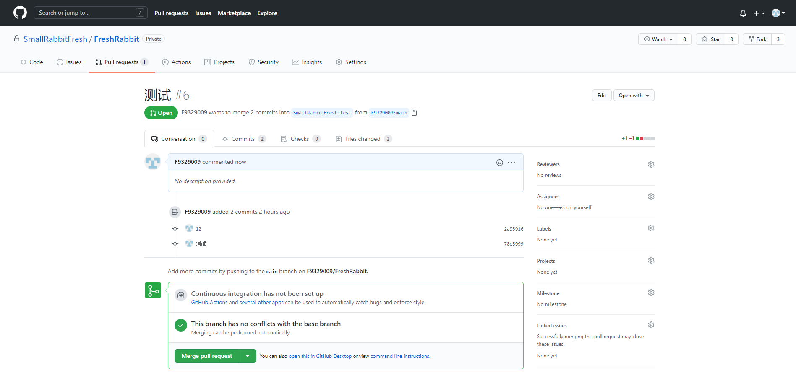

## 主项目仓库分支

```
main 分支(项目主分支 用于保存最终代码)
test 分支(项目测试分支 用于测试合并代码 合并没问题后提交到main主分支)
```

## 工作流

#### 准备工作：

##### 1.到主项目仓库fork项目到自己的库；(本教程第1步)

##### 2.设置上游地址。(本教程第2步)

#### 提交工作流：

##### 1.代码写完后先提交到自己的仓库`mian`;

##### 2.同步上游(upstream)仓库`main`到本地;(本教程第3步)

##### 3.如果同步完成后出现冲突，在自己的VSCode上解决冲突，解决后再次提交到自己的仓库`main`;

```
在VSCode上解决冲突比在github网页上解决方便
```

##### 4.没有冲突之后提交合并分支申请;(本教程第4步)

```
注意：不用点击本教程第5步的`Merge pull request`合并按钮
```

##### 5.队长或指定一个审核人员点击最后一步的`Merge pull request`合并按钮，并且拉取`test`分支到本地进行测试是否有冲突，测试没有冲突后才可以合并到主分支`main`。(本教程第5步)

## 1.到主项目仓库fork项目到自己的库

把fork到自己仓库的项目 Clone 到本地

```text
git clone git@github.com:自己github的用户名/FreshRabbit.git
```

输入`cd FreshRabbit`进入自己的Clone到本地的目录(之后的命令操作都在`FreshRabbit`目录下执行)

此时可以在控制台输入 `git remote -v` 命令查看当前远端仓库的地址，输出如下：

```text
origin  git@github.com:自己github的用户名/github-flow.git (fetch)
origin  git@github.com:自己github的用户名/github-flow.git (push)
```

该地址的远端（origin）为刚刚 fork 到自己的托管空间下项目地址。

## 2.设置上游地址

设置一个名字为 upstream 的上游地址，也就是我们项目主仓库的地址，在控制台执行：

```text
git remote add upstream git@github.com:SmallRabbitFresh/FreshRabbit.git
```

再次在控制台输入 `git remote -v` 命令查看当前远端仓库的地址，输出如下：

```text
origin  git@github.com:自己github的用户名/github-flow.git (fetch)
origin  git@github.com:自己github的用户名/github-flow.git (push)
upstream    git@github.com:SmallRabbitFresh/FreshRabbit.git (fetch)
upstream    git@github.com:SmallRabbitFresh/FreshRabbit.git (push)
```

设置上游地址的目的是当我们通过 pull request 的形式提到主仓库之后，本地仓库需要同步主仓库的代码，并及时更新到 origin（远端）仓库，保证自己托管空间下本地和远端仓库的代码都是最新的。

 

## 3.本地仓库与上游(upstream)仓库同步

执行以下命令即可同步

```
// 查看有无更新
git fetch upstream 
//切换分支 切换main与test
git checkout main   （test）
// 同步代码   要与切换的分支名一致
git merge upstream/main
```

注：`upstream`参数就是第二步创建的上游地址，`main`参数就是需要拉取的上游仓库的分支(因为main分支才是最终的代码，所有需要同步main分支)

## 4.本地仓库上传代码到上游(upstream)仓库

代码写完后先提交代码到自己的仓库，然后打开自己的仓库页面，打开`pull requests`页面，点击`New pull request`按钮新建合并分支的请求

 

主项目仓库选择`test`分支进行提交，自己的仓库选择`main`分支(因为我们提交到自己的仓库时是提交的main分支)，然后点击`Create pull request`按钮进入发送提交页面

 

填写合并请求的标题和说明后点击`Create pull request`按钮发送提交申请

 

## 5.合并测试分支&同步到主分支

队长或指定一个审核人员点击`Merge pull request`合并按钮并且拉取`test`分支到本地进行测试是否有冲突，测试没有冲突后才可以合并到主分支`main`

 


## 参考资料

https://zhuanlan.zhihu.com/p/39148914

## 文档说明

```txt
1. 组成说明
	组织库分为main与test
1.1 main与test说明：
		main 分支(项目主分支 用于保存最终代码)
		test 分支(项目测试分支 用于测试合并代码 合并没问题后提交到main主分支)
2. fork分支库：main与test
	2.1只是用main不用对test做出任何修改
```

